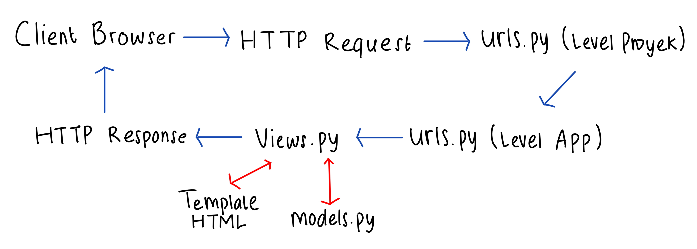
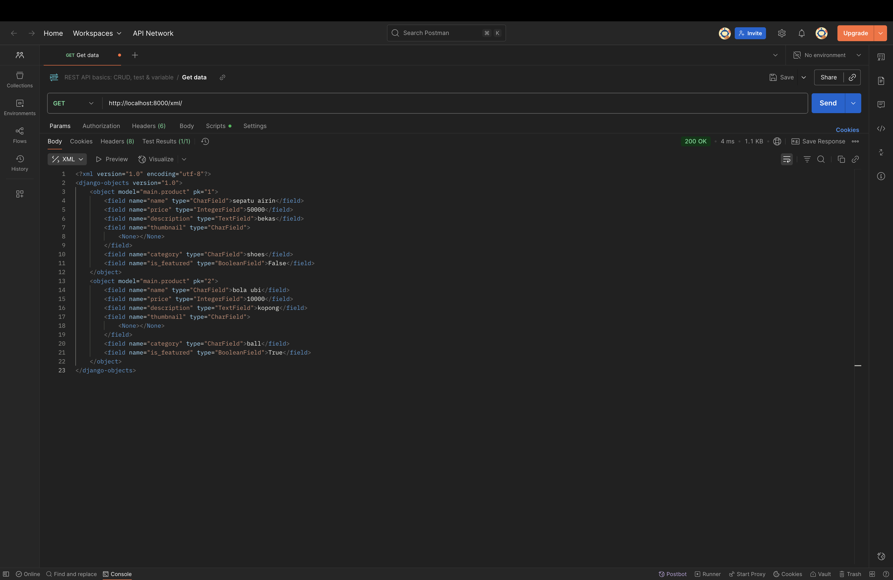

# SoccerHaus

## Step 1: Membuat Proyek Django Baru dan Konfigurasi Environment Variables
1. Buat direktori proyek baru bernama soccerhaus.
2. Buat virtual environment: `python3 -m venv env`
3. mengaktifkan virtual environment: `source env/bin/activate`
4. Buat berkas requirements.txt dan isi dengan beberapa dependencies
5. lalu install: `pip install -r requirements.txt`
6. Buat proyek Django bernama soccerhaus: `django-admin startproject soccerhaus .`
7. Buat file `.env` dan `.env.prod` di direktori utama
8. Tambahkan konfigurasi di `settings.py` untuk menggunakan environment variables
9. Jalankan migrasi database: `python3 manage.py migrate`
10. Jalankan server django: `python3 manage.py runserver`

## Step 2: Aplikasi main
1. Pastikan virtual environment aktif
2. Jalankan: `python manage.py startapp main`
3. Daftarkan aplikasi main di `INSTALLED_APPS` pada `settings.py`
4. Membuat direktori baru bernama `templates` dan buat file `main.html` di dalamnya
5. isi file `models.py` yang berada di direktori aplikasi main
6. Jalankan migrasi: `python3 manage.py makemigrations` dan `python3 manage.py migrate`
7. Hubungkan views dengan template dengan isi data di `views.py`
8. modifikasi file `main.html`

## Step 3: Konfigurasi Routing URL
1. buat file `urls.py` di direktori main dan isi file tersebut
2. buka file `urls.py` yan berada di direktori proyek soccerhaus
3. Impor fungsi include dari `django.urls.`
4. Tambahkan rute URL `path('', include('main.urls'))`

## Push ke repositori Github
1. Buat repositori GitHub baru dengan visibilitas public
2. Inisiasi git: `git init`
3. Buat file `.gitignore`
4. Menghubungan repositori lokal dengan repositori GitHub yang baru dibuat: `git remote add origin https://github.com/azizahairin/soccerhaus.git`
5. buat branch utama: `git branch -M master`
6. add, commit, dan push dari direktori repositori lokal.
`git add .`,
`git commit -m "..."`,
`git push origin master`

## Deployment melalui PWS
1. Buat proyek baru di PWS, copy environment variables `.env.prod`
2. Tambahkan URL PWS ALLOWED_HOSTS di `settings.py`
3. Jalankan perintah pada informasi Project Command
4. Jalakan `git push pws master` setiap ada perubahan

## request client ke web aplikasi berbasis Django beserta responnya dan kaitan antara urls.py, views.py, models.py, dan berkas html.

Saat pengguna membuka web SoccerHaus melalui browser, browser mengirim request ke server Django. Request pertama-tama dicek oleh urls.py di level proyek, yang menentukan aplikasi mana yang akan menangani request tersebut. Jika URL sesuai, request diteruskan ke urls.py di level aplikasi untuk memanggil view function yang cocok, seperti show_main di views.py.

views.py menerima request tersebut, lalu mengambil atau memproses data dari models.py. Misalnya, model Product menyimpan atribut seperti name, price, description, thumbnail, category, dan is_featured. Setelah data siap, view mengirimnya ke template HTML yang akan menampilkan informasi tersebut di halaman web. Template hanya menampilkan data yang dikirim view menggunakan template variables.

Hasil render template ini kemudian dikirim sebagai response ke browser, sehingga user bisa melihat tampilan web. Jadi, urls.py mengatur routing, views.py memproses data, models.py menyimpan struktur data, dan template HTML menampilkan tampilan akhir.

## peran settings.py dalam proyek Django
settings.py adalah berkas konfigurasi utama proyek Django yang mengatur semua pengaturan penting, mulai dari aplikasi apa saja yang dipakai, tempat nyimpen file, database. Misalnya, ALLOWED_HOSTS menentukan siapa saja yang boleh mengakses aplikasi. Jadi intinya, settings.py bikin proyek jalan dengan benar dan aman sesuai tempatnya: lokal atau server.

## cara kerja migrasi database di Django
Migrasi model adalah cara Django melacak setiap perubahan pada model basis data. Setiap kali menambahkan, menghapus, atau mengubah atribut di model, wajib melakukan migrasi agar perubahan tersebut tercermin di database. Untuk menjalankannya, pertama jalankan python manage.py makemigrations untuk membuat berkas migrasi, lalu jalankan python manage.py migrate untuk menerapkan perubahan tersebut ke database. Dengan begitu, struktur database selalu sesuai dengan model yang ada di kode. 

## framework Django dijadikan permulaan pembelajaran pengembangan perangkat lunak
Django dijadikan framework awal karena lengkap dan terstruktur. Banyak fitur yang sudah disediakan sehingga kita bisa langsung fokus memahami konsep inti pengembangan web, seperti MVT. Hal ini membuat alur data dan logika aplikasi lebih mudah dipahami tanpa harus membangun semuanya dari nol.

## Feedback untuk Asdos Tutorial 1
-

## Fungsi data delivery alam pengimplementasian sebuah platform
Kita memerlukan data delivery dalam sebuah platform karena setiap aplikasi seringkali membutuhkan cara yang berbeda untuk mengakses dan menggunakan data. Misalnya, pengguna biasa membutuhkan tampilan data dalam bentuk HTML agar mudah dibaca di browser, sementara aplikasi lain atau layanan eksternal mungkin membutuhkan data mentah dalam format JSON atau XML untuk diproses lebih lanjut. Dengan adanya data delivery, data dapat dibagikan dengan fleksibel sesuai kebutuhan, sehingga platform menjadi lebih mudah diintegrasikan, lebih efisien, dan bisa digunakan di berbagai perangkat atau sistem.

## Mana yang lebih baik antara XML dan JSON? Mengapa JSON lebih populer dibandingkan XML?
Secara umum, JSON dianggap lebih baik dibandingkan XML untuk kebutuhan pertukaran data modern. Hal ini karena JSON lebih sederhana, lebih mudah dibaca manusia, dan ukurannya lebih ringan sehingga lebih cepat diproses. JSON juga terintegrasi dengan baik pada hampir semua bahasa pemrograman, terutama JavaScript yang menjadi dasar pengembangan web. XML memang memiliki kelebihan dalam hal struktur yang ketat dan dukungan untuk dokumen yang kompleks, tetapi sering kali terasa terlalu berat untuk kebutuhan aplikasi web atau mobile. 

## Fungsi method is_valid() pada form Django
Method is_valid() pada form Django berfungsi untuk memeriksa apakah data yang dimasukkan ke dalam form sudah sesuai dengan aturan dan tipe data yang ditentukan di model atau form itu sendiri. Misalnya, kalau sebuah field harus angka tapi user mengisi teks, maka is_valid() akan mengembalikan false. Dengan begitu, kita bisa mencegah data yang salah atau tidak lengkap tersimpan ke database. Method ini penting karena membantu menjaga konsistensi dan keakuratan data, serta membuat aplikasi lebih aman dan terkontrol.

## Fungsi csrf_token
Kita membutuhkan csrf_token pada form Django untuk melindungi aplikasi dari serangan CSRF (Cross-Site Request Forgery). Token ini berfungsi sebagai tanda pengenal unik yang memastikan bahwa permintaan form benar-benar berasal dari pengguna yang sah, bukan dari pihak luar. Jika csrf_token tidak ditambahkan, penyerang bisa memanfaatkan celah ini dengan membuat halaman berbahaya yang diam-diam mengirim permintaan ke server kita menggunakan akun pengguna yang sedang login. Akibatnya, penyerang bisa melakukan aksi tanpa izin, seperti mengubah data atau mengirim informasi penting. Dengan adanya csrf_token, Django dapat memverifikasi setiap permintaan form dan mencegah serangan tersebut.

## Step-by-step Implementasi Checklist
1. Buat templates/base.html di root project (satu level dengan manage.py) sebagai layout utama.
2. Konfigurasi settings.py: TEMPLATES['DIRS'] = [BASE_DIR / 'templates'] dan  APP_DIRS=True.
3. Model: pakai Product di main/models.py (name, price, description, thumbnail (URL), category, is_featured).
4. Form: buat main/forms.py: ProductForm (ModelForm) dengan fields: ["name","price","description","thumbnail","category","is_featured"].
5. Views (main/views.py)
    - show_main: ambil Product.objects.all() dan kirim ke template.
    - create_product: tampilkan form (GET) & simpan produk baru (POST) dengan is_valid(), lalu redirect ke list.
    - show_product(id): ambil 1 produk by PK dan render halaman detail.
6. Templates
    - main/templates/main.html: tampilkan daftar produk, tombol “+ Add Product” dan tombol/link “View Detail”
    - main/templates/create_product.html: form tambah produk, pakai  untuk keamanan CSRF.
    - main/templates/product_detail.html: tampilkan field produk (name, price, category, is_featured, thumbnail, description).
7. Data Delivery: XML & JSON 
    - show_xml: Product.objects.all() ke XML + content_type="application/xml".
    - show_json: Product.objects.all() ke JSON + content_type="application/json".
    - show_xml_by_id(id): Product.objects.get(pk=id), content_type="application/xml".
    - show_json_by_id(id): sama seperti XML, tapi "json".
8. Routing URL di urls.py pada main
9. Jalanin server: python manage.py runserver.

## Feedback untuk Asdos Tutorial 2
tidak ada

## screenshot postman

  

## Apa itu Django AuthenticationForm
AuthenticationForm adalah form bawaan Django yang dipakai untuk proses login.
Form ini sudah menyediakan field username dan password, lalu otomatis memeriksa apakah data yang dimasukkan sesuai dengan data user di database Django (model User).
### Kekurangan:
- Kurang fleksibel jika butuh field tambahan
- Tampilan default sederhana
- Pesan error standar, jadi mungkin perlu dikustomisasi
### Kelebihan:
- Mudah dipakai
- Sudah terhubung dengan sistem Django Auth
- Validasi Otomatis

## Perbedaan antara autentikasi dan otorisasi
Autentikasi adalah proses untuk memastikan identitas seseorang yang ingin mengakses suatu sistem. Dalam konteks Django, autentikasi dilakukan dengan cara memeriksa data login seperti username dan password melalui mekanisme bawaan Django. Jika data yang dimasukkan sesuai dengan data yang tersimpan dalam basis data pengguna, maka pengguna dianggap valid dan Django akan membuat sesi sehingga pengguna tersebut dikenali sebagai request.user. Django menyediakan komponen seperti authenticate(), login(), serta middleware khusus yang menangani status autentikasi ini. Dengan demikian, autentikasi di Django berfungsi untuk menjawab pertanyaan: “Siapa pengguna ini?”
Otorisasi adalah proses untuk menentukan hak akses yang dimiliki oleh pengguna setelah identitasnya berhasil diverifikasi. Dalam Django, otorisasi diwujudkan melalui sistem izin (permissions) dan peran pengguna (user roles). Secara bawaan, setiap model di Django memiliki izin dasar seperti add, change, delete, dan view yang dapat diberikan kepada pengguna tertentu atau dikelompokkan melalui group. Django juga menyediakan atribut khusus seperti is_staff dan is_superuser untuk membedakan tingkat akses. Proses pemeriksaan izin dapat dilakukan dengan metode has_perm(), dekorator seperti @login_required atau @permission_required, serta mixin pada class-based view. Dengan demikian, otorisasi berfungsi untuk menjawab pertanyaan: “Apa yang boleh dilakukan pengguna ini?”

## Kelebihan dan kekurangan session dan cookies dalam konteks menyimpan state di aplikasi web
### Cookies
Cookies adalah data kecil yang disimpan langsung di sisi klien (browser). Cookies biasanya dipakai untuk menyimpan informasi sederhana seperti preferensi tampilan, data login otomatis , atau pengenal unik untuk pelacakan.
##### Kelebihan cookies:
- Mudah diakses oleh browser 
- Tidak membebani server karena data tidak disimpan di sisi server.
- Bisa digunakan lintas request
#### Kekurangan cookies:
- Rentan keamanan
- Ukuran terbatas 
- Bergantung pada user
### Sessions
Session adalah mekanisme penyimpanan data pengguna di sisi server. Browser hanya menyimpan sebuah session ID (biasanya di dalam cookie), sementara data detail pengguna tetap tersimpan di server.
#### Kelebihan session:
- Data sensitif tidak disimpan di user, hanya ID yang dikirim ke browser.
- Bisa menyimpan data lebih besar 
- Pengguna tidak bisa dengan mudah mengubah data karena kontrol penuh ada di server.
#### Kekurangan session:
- Membebani server karena semua data pengguna harus disimpan di server, terutama jika jumlah user sangat banyak.
- Bergantung pada cookies atau URL rewriting.
- Server perlu mengatur kapan session dibuat, diperbarui, atau dihapus.

## Apakah penggunaan cookies aman secara default dalam pengembangan web, atau apakah ada risiko potensial yang harus diwaspadai? Bagaimana Django menangani hal tersebut?
Penggunaan cookies tidak sepenuhnya aman secara default karena cookies pada dasarnya adalah data yang tersimpan di sisi klien (browser), sehingga berpotensi diakses, dimodifikasi, atau dicuri oleh pihak yang tidak berwenang. Risiko utama dari cookies antara lain adalah session hijacking (pencurian identitas sesi pengguna), cross-site scripting (XSS) di mana penyerang bisa menyuntikkan skrip berbahaya untuk membaca cookies, dan cross-site request forgery (CSRF) di mana cookies dipakai tanpa sepengetahuan pengguna. Selain itu, karena cookies selalu dikirim bersama setiap permintaan HTTP, ada kemungkinan data sensitif ikut terbawa jika tidak dikonfigurasi dengan benar.

Untuk mengurangi risiko ini, Django menyediakan beberapa mekanisme pengamanan cookies secara bawaan. Django menandai cookies penting seperti sessionid dengan atribut HttpOnly, sehingga cookies tidak bisa diakses melalui JavaScript dan lebih terlindungi dari serangan XSS. Django juga mendukung penggunaan atribut Secure, yang memastikan cookies hanya dikirim melalui koneksi HTTPS sehingga tidak mudah disadap. Selain itu, Django memiliki pengaturan CSRF protection yang otomatis melindungi form dari penyalahgunaan cookies pada permintaan berbahaya. Dengan demikian, penggunaan cookies bisa relatif aman selama dikombinasikan dengan konfigurasi keamanan yang tepat. Namun, pengembang tetap perlu berhati-hati, misalnya dengan menghindari penyimpanan data sensitif secara langsung di cookies, mengaktifkan opsi keamanan Django seperti SESSION_COOKIE_SECURE, SESSION_COOKIE_HTTPONLY, dan CSRF_COOKIE_SECURE, serta selalu menggunakan HTTPS untuk komunikasi data.

## Step-by-step Implementasi Checklist Tugas 4
1. Buka views.py dan tambahkan fungsi register, login, dan logout.
2. Tambahkan import yang diperlukan di views.py
3. Buat berkas html baru untuk register dan login.
4. Tambahkan button logout di main.html
5. Import fungsi register, login, dan logout di urls.py
6. Tambahkan path url ke dalam urlpatterns untuk mengakses fungsi yang
sudah diimpor tadi.
7. Tambahkan import login_required pada bagian paling atas di views.py
8. Tambahkan @login_required(login_url='/login') di atas fungsi show_main dan show_product untuk mengimplementasikan decorator.
9. Tambahkan import HttpResponseRedirect, reverse, dan datetime di views.py
10. tambahkan 'last_login': request.COOKIES['last_login'] ke dalam variabel context yang ada di show_main views.py
11. Ubah fungsi logout_user untuk menghapus cookie last_login setelah melakukan logout.
12. Hubungkan tiap object product dengan pengguna yang membuatnya, ubah di models.py 
13. Jalankan python manage.py makemigrations dan python manage.py migrate.
14. ubah fungsi cretae_product yang ada di views.py agar dapat mengisi field user dengan nilai request.user, yaitu pengguna yang sedang login.
15. modifikasi fungsi show_main untuk menampilkan halaman utama setelah user login dan dilengkapi dengan filter artikel berdasarkan penulis
16. Tambahkan tombol filter my dan all pada main.html
17. Tambahkan nama author di product_detail.html

##  urutan prioritas pengambilan CSS selector
Dalam CSS, jika satu elemen HTML dipengaruhi oleh beberapa selector sekaligus, browser akan menentukan gaya mana yang digunakan berdasarkan urutan prioritas (specificity). Prioritas ini dimulai dari **inline style** (atribut `style` langsung pada elemen) yang paling tinggi, kemudian **ID selector** (`#id`), diikuti oleh **class, pseudo-class, dan attribute selector** (`.class`, `:hover`, `[type=text]`), lalu **selector elemen/tag** (`div`, `p`, `h1`). Jika tingkat spesifisitasnya sama, aturan yang ditulis **paling akhir** di file CSS yang akan dipakai. Aturan dengan deklarasi `!important` juga akan mengalahkan gaya lainnya, meskipun sebaiknya digunakan hanya jika benar-benar diperlukan.

## Mengapa responsive design menjadi konsep penting dalam pengembangan aplikasi web
Responsive design penting karena memastikan tampilan dan fungsionalitas website dapat menyesuaikan ukuran layar dan perangkat pengguna — mulai dari desktop, laptop, tablet, hingga smartphone. Dengan responsive design, pengguna tidak perlu memperbesar atau menggeser layar secara manual, sehingga pengalaman pengguna (user experience) menjadi lebih nyaman, cepat, dan efisien**. Selain itu, responsive design juga meningkatkan aksesibilitas, kecepatan loading**, dan peringkat SEO, karena mesin pencari seperti Google memprioritaskan website yang ramah perangkat mobile.

**Contoh aplikasi yang sudah menerapkan responsive design:**

* **Shopee**: Halaman produk, keranjang belanja, dan menu navigasi otomatis menyesuaikan ketika dibuka di layar ponsel atau tablet. Tata letaknya berubah menjadi kolom tunggal agar mudah dibaca dan tombol lebih besar sehingga nyaman untuk disentuh.
* **YouTube**: Video akan otomatis menyesuaikan ukuran layar, dan tata letak menu akan bergeser menjadi tab bawah pada ponsel agar mudah diakses.

**Contoh aplikasi yang belum menerapkan responsive design:**

* Beberapa **website lama pemerintah atau sekolah** yang masih menggunakan layout fixed-width. Saat dibuka di ponsel, teks menjadi sangat kecil, tombol sulit ditekan, dan pengguna harus memperbesar layar secara manual. Ini membuat navigasi tidak nyaman dan sulit diakses di perangkat kecil.

Tanpa responsive design, pengguna berpotensi meninggalkan situs karena sulit dipakai, sementara aplikasi yang sudah responsive lebih ramah bagi semua perangkat dan mendukung pengalaman yang konsisten.

## perbedaan antara margin, border, dan padding
Margin, border, dan padding adalah tiga properti penting dalam CSS yang mengatur ruang di sekitar elemen HTML, tetapi fungsinya berbeda:

* **Margin** adalah ruang di luar elemen, yang memisahkan elemen tersebut dengan elemen lain di sekitarnya. Margin tidak memiliki warna; sifatnya transparan.
  Implementasi:
  .box {
    margin: 20px; /* Memberi jarak 20px di luar elemen */
  }

* **Border** adalah garis tepi yang mengelilingi elemen. Border terlihat dan dapat diberi warna, ketebalan, serta gaya (solid, dashed, dotted, dll.).
  Implementasi:
  .box {
    border: 2px solid #3F5A83; /* Garis tepi 2px, warna biru */
  }

* **Padding** adalah ruang di dalam elemen, antara isi (teks/gambar) dan garis tepi (border). Padding membuat isi elemen tidak menempel langsung pada tepi.
  Implementasi:
  .box {
    padding: 15px; /* Memberi jarak 15px antara isi dan border */
  }

Secara singkat: **padding = ruang dalam border**, **border = garis tepi elemen**, **margin = ruang luar elemen**.
Urutannya bisa dibayangkan seperti lapisan: **isi → padding → border → margin**.

## konsep flex box dan grid layout
1. Flexbox
 - Konsep:
    Flexbox dirancang untuk mengatur elemen dalam satu dimensi (baik secara horizontal row atau vertikal column). Elemen anak dalam container flex dapat menyesuaikan ukuran dan posisi secara otomatis agar tetap rapi di berbagai ukuran layar.
 - Kegunaan:
    A. Membuat tata letak yang fleksibel dan responsif.
    B. Menyusun elemen secara horizontal atau vertikal dengan mudah
    C. Mengatur jarak, perataan (alignment), dan urutan elemen tanpa banyak kode tambahan.
2. Grid Layout
 - Konsep:
    CSS Grid dirancang untuk mengatur elemen dalam dua dimensi (baris dan kolom sekaligus). Grid memungkinkan kita membuat struktur tata letak kompleks seperti tabel atau desain halaman modern dengan kontrol penuh.
 - Kegunaan:
    A. Membuat layout halaman yang memiliki beberapa baris dan kolom.
    B. Mengatur area halaman seperti header, sidebar, konten utama, dan footer.
    C. Sangat berguna untuk desain responsif yang lebih rumit.

## Step-by-step Implementasi Checklist Tugas 5
1. Edit & Delete Product
    - Tambah edit_product di views.py pakai ModelForm (prefill data), simpan saat POST.
    - Tambah delete_product di views.py pakai get_object_or_404, hapus via POST (bukan link GET).
    - Batasi hak akses: tombol Edit/Delete hanya muncul bila product.user == request.user.
    - Pasang URL route untuk edit & delete, dan pastikan tipe id konsisten (int).
2. Perbaiki Template Aksi di Card
    - Di card_product.html, tampilkan tombol Edit (link) dan Delete (form POST + ) hanya untuk pemilik.
    - Pastikan link detail pakai  agar reverse URL aman.
3. Konfigurasi Static & Tailwind
    - Aktifkan static files; load Tailwind via CDN di base.html.
    - Buat static/css/global.css untuk style custom (form, checkbox, dsb.).
    - Tambah CSS variables (pink, beige, blue) untuk palet konsisten.
4. Navbar Responsif
    - Buat navbar.html, include di semua halaman ().
    - Desain oval (beige) dengan brand “SoccerHaus”, warna sesuai palet.
    - Desktop: menu Home, Create Product, chip kategori.
    - Mobile: tombol hamburger + panel dropdown; toggle pakai JS sederhana (tutup otomatis saat klik link/di luar).
5. Halaman Home / Daftar Product
    - main.html: header “Latest Products” + subteks; filter All/My (query param ?filter=).
    - Grid card responsif (1–3 kolom).
    - Empty state:
        - All: gambar + pesan “No products found”.
        - My: kalau belum punya produk, tampilkan gambar + pesan khusus (tanpa ajakan “Create” kalau belum login).
    - Card pakai desain beige dengan badge kategori biru, tombol edit/delete sesuai palet.
6. Filter Kategori
    - Tambah tombol kategori (Jersey, Shoes, dll.)—di navbar (desktop & mobile) dan diproses di show_main pakai query param ?category=.
    - Kombinasi bisa dengan ?filter=my supaya menampilkan produk milik user di kategori tertentu.
7. Halaman Detail Product
    - product_detail.html: layout ramping (max-width sedang), gambar di atas, badge kategori + badge Owner (hanya untuk pemilik), judul, harga, deskripsi, dan box pemilik.
    - Tombol Edit/Delete di bagian bawah, tetap dalam palet.
8. Halaman Create & Edit Product
    - create_product.html & edit_product.html: card beige di atas background pink; input fokus dengan aksen biru.
    - Styling input lewat widgets di ProductForm (supaya tidak perlu filter add_class).
    - Tombol “Cancel” (outline biru) & “Publish/Update” (biru).
9. Auth Pages
    - login.html & register.html: logo SoccerHaus oval (biru text-on-beige), form pada card beige, tombol utama biru; konsisten dengan tema.
10. Keamanan & UX 
    - Lindungi delete via POST + CSRF.
    - Pakai  untuk kontrol tampilan aksi.
    - Tangani error general (mis. reverse URL, id kosong) dengan memastikan product.id selalu dipakai di URL template.
11. Uji Alur
    - Coba: daftar → login → tambah product → lihat card → filter All/My → filter kategori → detail → edit → delete.
    - Cek tampilan desktop & mobile (hamburger menu berfungsi).
12. Finishing
    - Rapikan spacing (jarak header–konten), kontras teks pada background, dan konsistensi warna tombol/badge sesuai palet pink–beige–blue.

## Perbedaan synchronous request dan asynchronous request
Synchronous berarti permintaan diproses satu per satu dan halaman biasanya melakukan reload penuh. Selama menunggu respons, pengguna “terkunci” (tidak bisa berinteraksi dengan hasilnya). Asynchronous (AJAX) mengirim permintaan di belakang layar lewat JavaScript tanpa reload halaman. Respons yang datang (biasanya JSON) dipakai untuk mengubah sebagian DOM saja, sehingga halaman terasa lebih cepat dan interaktif.

## Bagaimana AJAX bekerja di Django (alur request–response)
Pengguna menekan tombol/submit form → JavaScript menjalankan fetch() (atau XHR) ke URL Django → URL itu dipetakan ke views.py lewat urls.py → view memproses data (validasi, akses DB) lalu mengembalikan respons JSON (JsonResponse) → JavaScript membaca JSON dan memperbarui tampilan (misalnya menambah kartu produk, menutup modal, menampilkan toast) tanpa reload. Untuk permintaan POST, token CSRF ikut dikirim (via <input name="csrfmiddlewaretoken"> atau header X-CSRFToken) supaya Django menerimanya.

## Keuntungan menggunakan AJAX dibanding render biasa di Django
AJAX membuat aplikasi terasa lebih cepat karena hanya bagian tertentu yang diperbarui, bukan seluruh halaman. Bandwidth lebih hemat, pengalaman pengguna lebih mulus (tidak ada “kedip” reload), dan kita bisa menampilkan loading/empty/error state serta toast secara instan. Di sisi kode, pemisahan “data” (JSON dari view) dan “tampilan” (render di JS) memudahkan kita membangun UI yang reaktif.

## Keamanan saat menggunakan AJAX untuk Login dan Register di Django
Gunakan HTTPS agar kredensial terenkripsi; kirim permintaan POST dengan CSRF token (Django wajib), dan lakukan validasi di server memakai form/auth Django—jangan hanya mengandalkan validasi di sisi klien. Jangan menyimpan password atau token sensitif di localStorage; biarkan Django memakai session cookie (HttpOnly, Secure). Batasi informasi pada respons (pesan error jangan terlalu detail), gunakan @require_POST pada endpoint auth, dan aktifkan throttle/lockout bila perlu. Seluruh input harus disanitasi/di-clean di server.

## Dampak AJAX terhadap User Experience (UX)
UX jadi lebih responsif: aksi instan, ada indikator loading, empty, dan error, serta notifikasi toast yang jelas. Modal untuk create/update membuat alur tetap di tempat (tidak terlempar ke halaman lain), dan tombol refresh bisa memuat data terbaru tanpa memecah fokus pengguna. Singkatnya, interaksi lebih halus dan konsisten dibanding proses render penuh.

